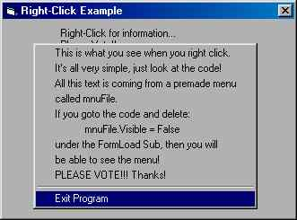



## Creating An EASY Right\-Click Menu\!\!

### Description

This code is very easy to understand. It will show you how to create a right-click menu for your app.. I could of made it more into detail but i wanted to be simple... You may use this code inny of your programs.. please vote..
 
### More Info
 

             |
---                |---
**Submitted On**   |1997-01-01 04:51:48
**By**             |[RyanConard](https://github.com/Planet-Source-Code/PSCIndex/blob/master/ByAuthor/ryanconard.md)
**Level**          |Beginner
**User Rating**    |4.0 (20 globes from 5 users)
**Compatibility**  |VB 5\.0, VB 6\.0
**Category**       |[Coding Standards](https://github.com/Planet-Source-Code/PSCIndex/blob/master/ByCategory/coding-standards__1-43.md)
**World**          |[Visual Basic](https://github.com/Planet-Source-Code/PSCIndex/blob/master/ByWorld/visual-basic.md)
**Archive File**   |[Creating\_A962456182002\.zip](https://github.com/Planet-Source-Code/ryanconard-creating-an-easy-right-click-menu__1-36002/archive/master.zip)

